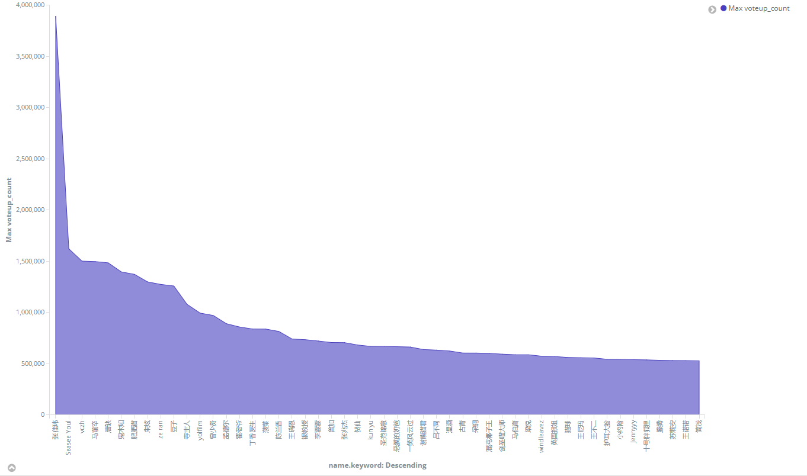
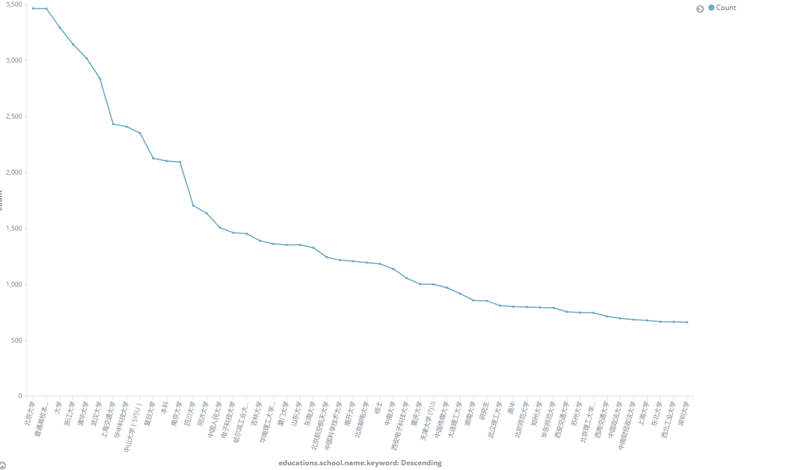
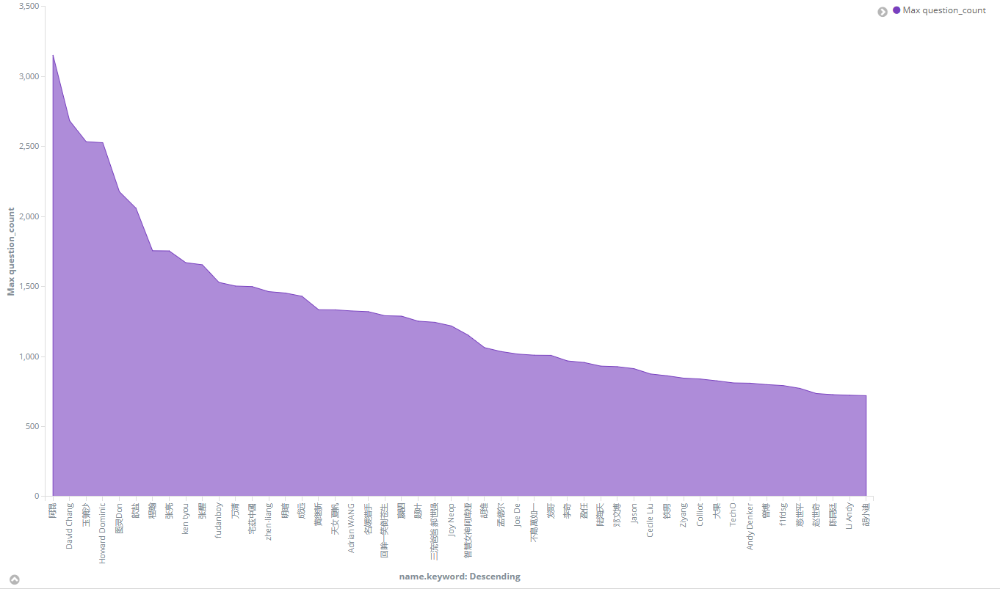

这是一个知乎爬虫项目
============

## 根据知乎用户爬取所有和用户相关的数据

  数据包括关注者,被关注者,文章,专栏,想法,提问,答案,和用户相关的其他信息

### 应的框架有
1. jdk1.8
2. spring-boot --基本架构
3. spring-data-elastic --elastic客户端
4. elasticsearch --搜索引擎,也用于存储数据
5. kinaba --数据展示和分析
6. 爬取网页用的spring提供的restTemplate

 ### 说明
 1. 使用spring的resttemplate抓去知乎的接口
 2. 使用数据线程池实现多线程抓取
 3. 记录上次停顿的位置实现连续抓取
 4. 控制抓取的数据类型
 5. 去重使用的是elsstic提供的upset方法,id的话,people使用url_token
 6. 当访问被限制的时候切换本地的http代理,不想找线程池,所以一般只开两个线程进行抓取,不得不说知乎反爬虫做的挺好,只开一个线程的时候不会被屏蔽,多了就不行了
 7. 跑了一个星期大概抓取了200W的用户数据和其他的一些
 8. 先爬取几条记录,然后代码就会自动把记录写入任务队列中
 

 一些浅陋的分析
 ---------
 
 
 关注的人最多的人
 
 
 被关注的人最多的人
 
 
 
 感谢最多的
 
 
 
 学校 比较有趣
 
 
 
 回答问题最多,真劳模
 
 
 
 提问最多
 
 
 
 提问最多的主题,有趣
 
 
职位,也很有趣

 看图把,我不贴了

